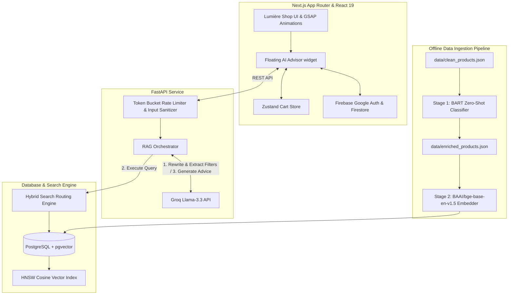

# ✦ Lumière: AI-Powered Luxury Beauty Store

Lumière is a premium, high-fidelity e-commerce experience featuring an **Async Retrieval-Augmented Generation (RAG) Search Engine**. It integrates a hybrid relational-semantic vector database, an offline NLP-driven classification pipeline, and an interactive LLM beauty advisor.

---

## 🏗️ System Architecture



---

## ⚡ Core Features

1. **High-Performance Hybrid Search Engine** ([search_engine.py](file:///e:/beauty-api/backend/search_engine.py))
   Routes search queries dynamically into three paradigms:
   * **Pure Relational**: SQL filters for structured metadata (e.g., `product_type`, `price`, `color`).
   * **Pure Semantic**: Cosine similarity vector search using `pgvector` with $768$-dimension embeddings (`BAAI/bge-base-en-v1.5`).
   * **True Hybrid Search**: Blends both relational SQL predicates and semantic vector calculations on a fast HNSW database index.
2. **Context-Aware Conversational RAG** ([app.py](file:///e:/beauty-api/backend/app.py))
   * **Query Contextualizer**: Groq-based Llama-3.3-70B model parses chat history, extracts mathematical price filters, and rewrites messages into standalone queries.
   * **Dual LLM Verification**: Generates tailored beauty suggestions in JSON Mode, aligning matching products directly with database entries.
3. **Offline ML Enrichment Pipeline**
   * **Stage 1 ([enrich_catalog.py](file:///e:/beauty-api/backend/enrich_catalog.py))**: Classifies product catalog descriptions through `facebook/bart-large-mnli` zero-shot classification to standardize finishes and colors.
   * **Stage 2 ([load_products.py](file:///e:/beauty-api/backend/load_products.py))**: Computes embeddings using BGE-v1.5 and upserts them into PostgreSQL with active HNSW index updates.
4. **Rich Luxury Frontend** ([page.tsx](file:///e:/beauty-api/frontend/app/page.tsx))
   * Seamless GSAP scroll reveal animations, dynamic mouse trails, and glassmorphism styling.
   * Session persistence using Firebase Firestore.
   * Global state management for checkout/shopping cart using Zustand.

---

## 📁 Key File Structure

```text
├── backend/
│   ├── app.py                # FastAPI API gateway & RAG orchestration
│   ├── search_engine.py      # Hybrid vector & structured postgres search routing
│   ├── ranking_model.py      # Multi-criteria Learning-to-Rank engine (optional)
│   ├── enrich_catalog.py     # Stage 1: Zero-shot NLP classifier (BART)
│   ├── load_products.py      # Stage 2: Embed (BGE-v1.5) & ingestion script
│   └── setup_db.py           # PostgreSQL tables & HNSW indices initialization
├── data/
│   ├── clean_products.json   # Raw product dataset
│   └── enriched_products.json# NLP-standardized products dataset
└── frontend/
    ├── app/                  # Next.js App Router pages
    ├── components/           # UI elements (AIChat, FeaturedProducts, etc.)
    └── lib/                  # Stores (Zustand) & Client SDK Configs (Firebase)
```

---

## ⚙️ Environment Variables

### Backend (`backend/.env`)
```env
DATABASE_URL=postgresql://<user>:<password>@<host>/<db>
GROQ_API_KEY=gsk_...
```

### Frontend (`frontend/.env.local`)
```env
NEXT_PUBLIC_FIREBASE_API_KEY=
NEXT_PUBLIC_FIREBASE_AUTH_DOMAIN=
NEXT_PUBLIC_FIREBASE_PROJECT_ID=
NEXT_PUBLIC_FIREBASE_STORAGE_BUCKET=
NEXT_PUBLIC_FIREBASE_MESSAGING_SENDER_ID=
NEXT_PUBLIC_FIREBASE_APP_ID=

DATABASE_URL=postgresql://<user>:<password>@<host>/<db>
BACKEND_URL=http://127.0.0.1:8080
```

---

## 🚀 Quick Setup

### 1. Ingest Data & Run Backend
Navigate to `backend/`, configure `.env`, install requirements, and run:
```bash
# 1. Standardize finishes/colors using local BART model
python enrich_catalog.py

# 2. Setup PostgreSQL database tables and HNSW indices
python setup_db.py

# 3. Compute BGE embeddings and load catalog into PostgreSQL
python load_products.py

# 4. Start the API server
python app.py
```

### 2. Launch Client Frontend
Navigate to `frontend/`, configure `.env.local`, and run:
```bash
npm install
npm run dev
```
Open `http://localhost:3000` to interact with the application.

---

## 🌐 Deployment & Architecture

The application uses a decoupled, production-grade architecture built to handle asynchronous machine learning workloads efficiently.

* **Frontend Hosting**: Vercel / Netlify
* **Backend Hosting**: Deployed as a containerized serverless application on Google Cloud Run with an allocated resource limit of 4 GiB RAM and 1 CPU Boost to accommodate embedding model loads.
* **Package Management**: Managed via Poetry inside a multi-stage Docker build utilizing a `python:3.12-slim` base image.
* **Database**: Production PostgreSQL cluster hosted on Render.
* **CI/CD**: Automated builds triggered via Google Cloud Build connected directly to the main repository line.
